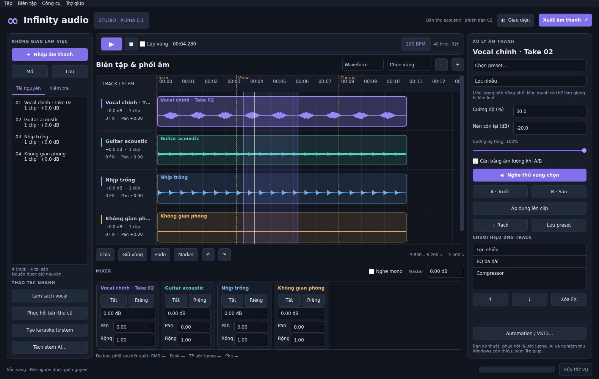

# Infinity audio

Ứng dụng chỉnh sửa âm thanh desktop bằng tiếng Việt. **Bản 0.1.0-alpha.1 là bản kỹ thuật có mã chạy và kiểm thử, chưa phải sản phẩm hoàn tất 47 yêu cầu. Chưa có bộ cài Windows `.exe` đã được build/kiểm chứng.**



## Có gì trong gói này?

- Mã nguồn Qt desktop, DSP thực, timeline nhiều track, mixer, preview A/B, lịch sử và dự án portable `.infinity`.
- Các phép phục hồi cơ bản, pitch/tempo, sửa cao độ đơn âm thử nghiệm, formant thử nghiệm, EQ, compressor/gate, FX, LUFS, xuất WAV/FLAC/MP3.
- Bộ nối VST3 tách tiến trình và Demucs local thử nghiệm; xem trạng thái chưa nghiệm thu trong ma trận.
- Tests tự động, mẫu âm thanh tổng hợp trước/sau, dự án demo, ảnh chụp giao diện thật.
- PyInstaller spec, script NSIS tạo bộ cài `.exe`, workflow Windows CI và checklist Windows sạch.

Trạng thái kiểm chứng hiện tại: **93/93 test đạt trên Linux**, cùng 5 mẫu DSP trước/sau,
6 mức bitrate MP3 và các bài tải 32 track, 10 phút và 20 file hàng loạt. Chi tiết nằm trong
`docs/TEST_REPORT_VI.md`; `evidence/linux-freeze-smoke.txt` chỉ là smoke-test binary Linux.

## Chạy từ mã nguồn (dành cho người build)

Windows x64, Python **3.12**:

```powershell
py -3.12 -m venv .venv
.\.venv\Scripts\python -m pip install -r requirements-dev.txt
.\.venv\Scripts\python -m pip install -e . --no-deps
.\.venv\Scripts\python launch.py
```

Linux để kiểm thử phát triển:

```bash
python3.12 -m venv .venv
.venv/bin/python -m pip install -r requirements-dev.txt
.venv/bin/python -m pip install -e . --no-deps
QT_QPA_PLATFORM=offscreen .venv/bin/python launch.py --smoke-test
.venv/bin/python -m pytest -q
```

Tái tạo bằng chứng codec/DSP và tải:

```bash
.venv/bin/python scripts/validate_release.py evidence
.venv/bin/python scripts/write_report.py
```

Linux cần PortAudio hệ thống để phát qua thiết bị; kiểm thử Qt offscreen không cần thiết bị âm thanh. Đây không phải hướng dẫn cài đặt cho người dùng cuối. Người dùng cuối chỉ nên nhận bộ cài đã qua cổng Windows.

## Tài liệu

- [Kiến trúc và các giai đoạn](docs/ARCHITECTURE_VI.md)
- [Hướng dẫn sử dụng](docs/USER_GUIDE_VI.md)
- [Build, đóng gói và mô hình AI](docs/BUILD_WINDOWS_VI.md)
- [Ma trận đầy đủ 47 yêu cầu](docs/FEATURE_MATRIX_VI.md)
- [Báo cáo kiểm thử thực tế](docs/TEST_REPORT_VI.md)
- [Checklist nghiệm thu Windows sạch](docs/WINDOWS_ACCEPTANCE_VI.md)
- [Giới hạn và việc còn thiếu](docs/KNOWN_LIMITATIONS_VI.md)
- [Thành phần bên thứ ba](THIRD_PARTY_NOTICES.md)

Chạy `python scripts/capture_ui.py` để tạo `evidence/Demo-acoustic.infinity` và ảnh giao diện; chạy `python scripts/validate_release.py evidence` để tạo các cặp A/B. Âm thanh demo được tạo tổng hợp bằng mã, không phải bản thu người thật hay minh chứng chất lượng tách stem. Các file audio lớn được tạo lại từ script, không lưu vào Git.

## Pipeline Windows

Repo dành riêng cho dự án: https://github.com/musiclife2292-blip/infinity

Workflow chạy tests, tạo mẫu DSP, đóng gói PyInstaller + NSIS, rồi dùng một runner Windows khác để cài/chạy/gỡ bản alpha. Diagnostic `InfinityAudio.exe --self-test report.json` kiểm tra giao diện, xử lý, codec, dự án và khôi phục ngay trong binary đã đóng gói. Playback của diagnostic dùng buffer bộ nhớ; thiết bị âm thanh thật chưa được chứng minh bởi CI. Chỉ job cài đặt thành công mới tạo artifact `Infinity-audio-win64-alpha`.

Mã ứng dụng trong gói được chuẩn bị theo **GPL-3.0-only** để phù hợp Pedalboard/JUCE. Chưa có trọng số AI, plugin bên thứ ba hoặc binary Windows trong gói. Xem thông báo bản quyền và cổng pháp lý trước khi phân phối.
