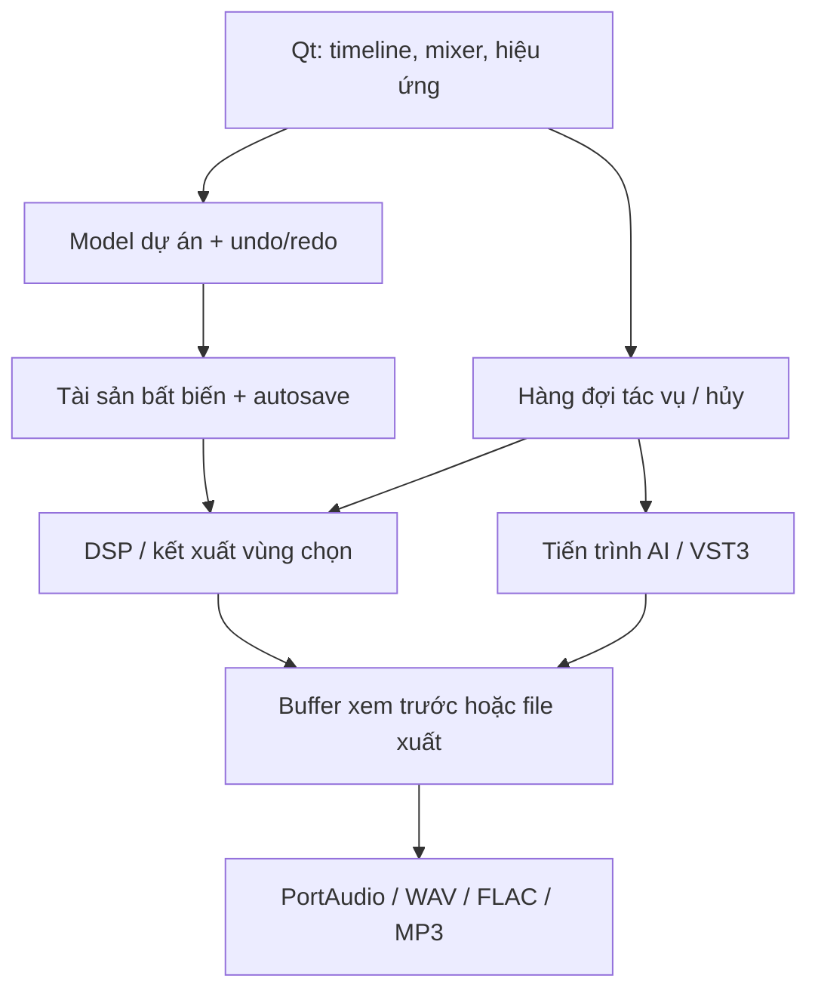

# Infinity audio — kiến trúc và kế hoạch

Trạng thái ban đầu: dự án mới, không có mã nguồn hay file âm thanh thực tế do người dùng cung cấp. Mục tiêu sản phẩm là ứng dụng Windows desktop 64 bit, có bộ cài `.exe`, giữ đủ 47 yêu cầu. Bản 0.1 là mốc kỹ thuật để kiểm chứng; không phải bản phát hành đã nghiệm thu.

## Quyết định công nghệ

| Thành phần | Lựa chọn | Lý do và ranh giới |
|---|---|---|
| Giao diện | Python 3.12 + PySide6/Qt Widgets 6.8.3 | Desktop native, Unicode tiếng Việt, bàn phím, kéo thả, accessibility, dark/light; không cần trình duyệt |
| DSP | NumPy, SciPy, Pedalboard, librosa | Bộ lọc và STFT có thể đo lường; thư viện native cho hiệu ứng; phase vocoder cho pitch/tempo |
| Phát | sounddevice/PortAudio | Callback chỉ đọc buffer đã kết xuất; không chạy AI hoặc đọc đĩa trong callback |
| Dự án | JSON có schema + tài sản float32 bất biến, gói ZIP `.infinity` | Nguồn không bị ghi đè; lịch sử dùng tham chiếu; lưu qua file tạm rồi atomic replace |
| Tác vụ | Qt worker thread + cancellation token | UI tiếp tục nhận sự kiện; kết quả chỉ được commit sau khi xong; không chạy cùng lúc hai thao tác sửa dự án |
| Plugin | VST3 effect qua Pedalboard, subprocess có timeout | Quét/nạp ngoài UI, cô lập crash; lưu tham số/state; không hỗ trợ VST2/AU/CLAP trong mốc này |
| AI | Bộ nối Demucs tùy chọn, mô hình local | Chưa gộp trọng số vào bộ cài; phải kiểm tra quyền phân phối và chất lượng riêng |
| Windows | PyInstaller onedir + NSIS | Đóng gói Python và DLL; người dùng cuối không cài Python; installer chỉ chạy trong phạm vi user |

Định hướng phân phối mã ứng dụng theo GPL-3.0-only tương thích phụ thuộc Pedalboard GPLv3. Nếu cần sản phẩm đóng nguồn, phải thay host/DSP GPL hoặc mua quyền phù hợp trước khi phát hành. Mã và trọng số AI có giấy phép độc lập.

## Dòng dữ liệu

UI không biết chi tiết thuật toán. DSP nhận mảng `frames × channels`, float32, sample rate xác định và không sửa input. Thời gian trong model là giây, chỉ đổi sang số mẫu khi render. Import resample về sample rate dự án; mỗi clip có source offset, timeline position, length và fade. Hiệu ứng track chạy sau sum clip, automation sau hiệu ứng, bus master cuối cùng. Mixing trong float, không âm thầm clamp khi xuất: file vượt mức phải qua limiter hoặc chỉnh gain.

Preview A/B dùng cùng vùng/thời điểm, có bù RMS tùy chọn. Các xử lý nặng là offline; playback là phát buffer đã render. Mốc 0.1 chưa tuyên bố DSP realtime độ trễ thấp hay chuẩn LUFS/true-peak được chứng nhận. Phân tích nhận diện và thuật toán phục hồi có thể sai; không khôi phục được thông tin đã mất hoàn toàn.

## Các mốc và cổng kiểm thử

| Mốc | Yêu cầu được bao phủ | Sản phẩm và cổng ra |
|---|---|---|
| M0 — nền tảng | Toàn bộ 1–47 | Kiến trúc, ma trận yêu cầu, bản Qt mở được, giấy phép nguồn chính thức |
| M1 — editor | 12,14–20,26,32,39,40,46 | Nhập → chỉnh sửa → nghe → lưu → mở → xuất; round-trip sample; undo/redo; lỗi file; source không đổi |
| M2 — DSP | 1–9,17,18,22,23,27–37,41,44,45 | Kiểm thử tín hiệu tổng hợp, mẫu trước/sau; gain/frequency/duration/peak được đo; hủy không commit |
| M3 — phân tích | 21,24,25,38,42,43 | Dataset có nhãn và nghe đánh giá; note editor/warp/vocal alignment; phân biệt heuristic và kết quả đã xác nhận |
| M4 — AI & plugin | 2,7,10–14,21,25,27,47 | Mô hình đủ quyền phân phối; kiểm thử stem có ground truth; các VST3 thực tế, timeout/crash/state recall |
| M5 — release | Toàn bộ 1–47 | Bộ cài Windows sạch; kiểm thử đủ 47; file dài/nhiều track/batch; không P0/P1; ký số và phát hành |

M2 và M3 không thay thế M4: EQ làm rõ tiếng không tương đương phục hồi AI; bộ lọc mid/side không được gọi là tách stem AI. Không đổi phạm vi 47 yêu cầu. Hạng mục chưa đạt vẫn nằm trong ma trận và chặn nghiệm thu đầy đủ.

## Hệ điều hành và tài nguyên

Mục tiêu kiểm thử Windows 11 23H2/24H2 x64 và Windows 10 22H2 x64; đây là mục tiêu tương thích, chưa xác nhận ứng dụng chạy trên các phiên bản đó. Không cam kết Windows 7/8, x86 hoặc ARM64. Qt 6.8 liệt kê Windows 10 1809+ và Windows 11 x64; đó là hỗ trợ của framework, không phải bằng chứng kiểm thử sản phẩm.

Mức dự kiến cho bản cơ bản: CPU x64 4 nhân, RAM 8 GB, SSD 4 GB trống cộng dữ liệu dự án, màn hình 1280×800. Khuyến nghị CPU 8 nhân, RAM 16–32 GB, SSD với dung lượng trống ≥ 3 lần tài sản của dự án, 1920×1080. Không cần GPU cho DSP cơ bản. AI dự kiến 16 GB RAM; NVIDIA CUDA có thể tăng tốc nhưng phải benchmark từng model/driver. Đây là ngân sách thiết kế chưa được xác nhận qua máy Windows thực.

DSP, chỉnh sửa và xuất chạy offline. Build cài dependencies cần Internet. Model/plugin phải do người dùng chọn từ máy, không tải im lặng. Không gửi âm thanh lên server. Tác vụ kết xuất có ngân sách bộ nhớ và giới hạn thời lượng được công bố; cần streaming engine trước khi cam kết DAW cho nhiều giờ/100 track.

## An toàn dữ liệu và lỗi

Asset có SHA-256; chỉ đọc `numpy.load(..., allow_pickle=False)`. Project chỉ chấp nhận đường dẫn asset theo mẫu SHA; kiểm tra kích thước, checksum và schema trước khi thay dự án. Lưu atomic, giữ bản `.bak`; autosave và lịch sử chứa cả tham chiếu dữ liệu cũ. Hủy xử lý không thay model. Thiếu ổ đĩa, file lỗi, codec thiếu, plugin timeout đều trả lỗi rõ. Không ghi âm thanh ngoài range hợp lệ mà không thông báo. Không mở plugin nhị phân tự động từ file dự án; yêu cầu nạp lại có chủ ý qua quản lý plugin.

## Nguồn kỹ thuật được đối chiếu

- Qt platforms: https://doc.qt.io/qt-6.8/supported-platforms.html
- Qt license: https://doc.qt.io/qt-6.8/licensing.html
- PyInstaller cần build trên OS đích: https://pyinstaller.org/en/stable/
- PyInstaller exception: https://pyinstaller.org/en/stable/license.html
- Pedalboard: https://github.com/spotify/pedalboard ; https://spotify.github.io/pedalboard/reference/pedalboard.html
- SoundFile/libsndfile: https://python-soundfile.readthedocs.io/en/latest/
- librosa: https://librosa.org/doc/0.11.0/index.html
- Demucs stems: https://github.com/facebookresearch/demucs
- Thảo luận tác giả về quyền trọng số: https://github.com/facebookresearch/demucs/issues/327
- NSIS: https://nsis.sourceforge.io/License

Ngày đối chiếu: 2026-09-14. Trước phát hành cần audit tất cả binary/transitive dependency cụ thể, thông báo bản quyền, nguồn tương ứng GPL và giấy phép từng model/plugin; hiện không chứng nhận đã đủ điều kiện phân phối thương mại mọi thành phần.
